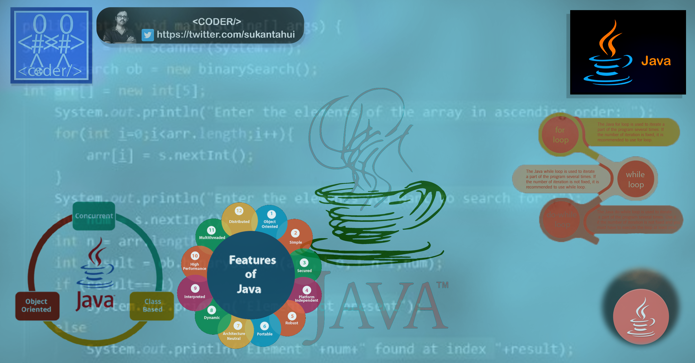

<div align="center">
  <h1> Java tokens, CODER</h1>
  <a class="header-badge" target="_blank" href="https://www.linkedin.com/in/sukantahui/">
  
  </a>
  <a class="header-badge" target="_blank" href="https://twitter.com/sukantahui">
  
  </a>

<sub>Author:
<a href="https://www.linkedin.com/in/sukantahui/" target="_blank">Sukanta Hui</a><br>
<small> Second Edition: July, 2021</small>
</sub>

</div>

[<<Home](../readme.md) | [Day 3 >>](../03_Day_Operators/03_operators.md)



- [📘 Java Tokens](#-java-tokens)
  - [Keywords](#Keywords)
  - [Identifiers](#identifiers)
    - [Declaring Multiple Variable in a Line](#declaring-multiple-variable-in-a-line)
  - [Data Types](#data-types)
  - [Checking Data types and Casting](#checking-data-types-and-casting)
  - [Numbers](#numbers)
  - [💻 Exercises - Day 2](#-exercises---day-2)
    - [Exercises: Level 1](#exercises-level-1)
    - [Exercises: Level 2](#exercises-level-2)

# 📘 Java Tokens

## Keywords

Keywords are pre-defined or reserved words in a programming language. Each keyword is meant to perform a specific function in a program. Since keywords are referred names for a compiler, they can’t be used as variable names because by doing so, we are trying to assign a new meaning to the keyword which is not allowed. Java language supports following keywords: 
[Check our website](https://eduvenv.in/#/courseContent).
```shell
01. abstract 	    02. boolean 	03. byte 	04. break 	05. class
06. case 	        07. catch 	08. char 	09. continue 	10. default
11. do 	          12. double 	13. else 	14. extends 	15. final
16. finally 	    17. float 	18. for 	19. if 	20. implements
21. import 	      22. instanceof 	23. int 	24. interface 	25. long
26. native 	      27. new 	28. package 	29. private 	30. protected
31. public 	      32. return 	33. short 	34. static 	35. super
36. switch 	      37. synchronized 	38. this 	39. thro	40. throws
41. transient 	  42. try 	43. void 	44. volatile 	45. while
46. assert 	      47. const 	48. enum 	49. goto 	50. strictfp
```

## Identifiers

Identifiers are used as the general terminology for naming of variables, functions and arrays. These are user-defined names consisting of an arbitrarily long sequence of letters and digits with either a letter or the underscore(_) as a first character. Identifier names must differ in spelling and case from any keywords. You cannot use keywords as identifiers; they are reserved for special use. Once declared, you can use the identifier in later program statements to refer to the associated value. A special kind of identifier, called a statement label, can be used in goto statements.

Examples of valid identifiers :

```shell
MyVariable
MYVARIABLE
myvariable
x
i
x1
i1
_myvariable
$myvariable
sum_of_array
geeks123
```

Invalid variables names

```shell
first-name
first@name
first$name
num-1
1num
```

We will use standard Python variable naming style which has been adopted by many Python developers. Python developers use snake case(snake_case) variable naming convention. We use underscore character after each word for a variable containing more than one word(eg. first_name, last_name, engine_rotation_speed).  The example below is an example of standard naming of variables, underscore is required when the variable name is more than one word.

When we assign a certain data type to a variable, it is called variable declaration. For instance in the example below my first name is assigned to a variable first_name. The equal sign is an assignment operator. Assigning means storing data in the variable. The equal sign in Python is not equality as in Mathematics.

_Example:_

```py
# Variables in Python
first_name = 'Sukanta'
last_name = 'Hui'
country = 'India'
city = 'Barrackpore'
age = 46
is_married = True
skills = ['HTML', 'CSS', 'JS', 'React', 'Python']
person_info = {
   'firstname':'Sukanta',
   'lastname':'Hui',
   'country':'India',
   'city':'Barrackpore'
   }
```

Let us use the _print()_ and _len()_ built-in functions. Print function takes unlimited number of arguments. An argument is a value which we can be passed or put inside the function parenthesis, see the example below.

**Example:**

```py
print('Hello, World!') # The text Hello, World! is an argument
print('Hello',',', 'World','!') # it can take multiple arguments, four arguments have been passed
print(len('Hello, World!')) # it takes only one argument
```

Let us print and also find the length of the variables declared at the top:

**Example:**

```py
# Printing the values stored in the variables

print('First name:', first_name)
print('First name length:', len(first_name))
print('Last name: ', last_name)
print('Last name length: ', len(last_name))
print('Country: ', country)
print('City: ', city)
print('Age: ', age)
print('Married: ', is_married)
print('Skills: ', skills)
print('Person information: ', person_info)
```

### Declaring Multiple Variable in a Line

Multiple variables can also be declared in one line:

**Example:**

```py
first_name, last_name, country, age, is_married = 'Sukanta', 'Hui', 'Helsink', 46, True

print(first_name, last_name, country, age, is_married)
print('First name:', first_name)
print('Last name: ', last_name)
print('Country: ', country)
print('Age: ', age)
print('Married: ', is_married)
```

Getting user input using the _input()_ built-in function. Let us assign the data we get from a user into first_name and age variables.
**Example:**

```py
first_name = input('What is your name: ')
age = input('How old are you? ')

print(first_name)
print(age)
```

## Data Types

There are several data types in Python. To identify the data type we use the _type_ built-in function. I would like to ask you to focus on understanding different data types very well. When it comes to programming, it is all about data types. I introduced data types at the very beginning and it comes again, because every topic is related to data types. We will cover data types in more detail in their respective sections.

## Checking Data types and Casting

- Check Data types: To check the data type of certain data/variable we use the _type_
  **Example:**

```py
# Different python data types
# Let's declare variables with various data types

first_name = 'Sukanta'     # str
last_name = 'Hui'       # str
country = 'India'         # str
city= 'Barrackpore'            # str
age = 46                   # int, it is not my real age, don't worry about it

# Printing out types
print(type('CODER'))     # str
print(type(first_name))     # str
print(type(10))             # int
print(type(3.14))           # float
print(type(1 + 1j))         # complex
print(type(True))           # bool
print(type([1, 2, 3, 4]))     # list
print(type({'name':'Sukanta','age':46, 'is_married':True}))    # dict
print(type((1,2)))                                              # tuple
print(type(zip([1,2],[3,4])))                                   # set
```

- Casting: Converting one data type to another data type. We use _int()_, _float()_, _str()_, _list_, _set_
  When we do arithmetic operations string numbers should be first converted to int or float otherwise it will return an error. If we concatenate a number with a string, the number should be first converted to a string. We will talk about concatenation in String section.

  **Example:**

```py
# int to float
num_int = 10
print('num_int',num_int)         # 10
num_float = float(num_int)
print('num_float:', num_float)   # 10.0

# float to int
gravity = 9.81
print(int(gravity))             # 9

# int to str
num_int = 10
print(num_int)                  # 10
num_str = str(num_int)
print(num_str)                  # '10'

# str to int or float
num_str = '10.6'
print('num_int', int(num_str))      # 10
print('num_float', float(num_str))  # 10.6

# str to list
first_name = 'Sukanta'
print(first_name)               # 'Sukanta'
first_name_to_list = list(first_name)
print(first_name_to_list)            # ['A', 's', 'a', 'b', 'e', 'n', 'e', 'h']
```

## Numbers

Number data types in Python:

1. Integers: Integer(negative, zero and positive) numbers
   Example:
   ... -3, -2, -1, 0, 1, 2, 3 ...

2. Floating Point Numbers(Decimal numbers)
   Example:
   ... -3.5, -2.25, -1.0, 0.0, 1.1, 2.2, 3.5 ...

3. Complex Numbers
   Example:
   1 + j, 2 + 4j, 1 - 1j

🌕 You are awesome. You have just completed day 2 challenges and you are two steps ahead on your way to greatness. Now do some exercises for your brain and muscles.

## 💻 Exercises - Day 2

### Exercises: Level 1

1. Inside 30DaysOfPython create a folder called day_2. Inside this folder create a file named variables.py
2. Write a python comment saying 'Day 2: 30 Days of python programming'
3. Declare a first name variable and assign a value to it
4. Declare a last name variable and assign a value to it
5. Declare a full name variable and assign a value to it
6. Declare a country variable and assign a value to it
7. Declare a city variable and assign a value to it
8. Declare an age variable and assign a value to it
9. Declare a year variable and assign a value to it
10. Declare a variable is_married and assign a value to it
11. Declare a variable is_true and assign a value to it
12. Declare a variable is_light_on and assign a value to it
13. Declare multiple variable on one line

### Exercises: Level 2

1. Check the data type of all your variables using type() built-in function
1. Using the _len()_ built-in function, find the length of your first name
1. Compare the length of your first name and your last name
1. Declare 5 as num_one and 4 as num_two
    1. Add num_one and num_two and assign the value to a variable total
    2. Subtract num_two from num_one and assign the value to a variable diff
    3. Multiply num_two and num_one and assign the value to a variable product
    4. Divide num_one by num_two and assign the value to a variable division
    5. Use modulus division to find num_two divided by num_one and assign the value to a variable remainder
    6. Calculate num_one to the power of num_two and assign the value to a variable exp
    7. Find floor division of num_one by num_two and assign the value to a variable floor_division
1. The radius of a circle is 30 meters.
    1. Calculate the area of a circle and assign the value to a variable name of _area_of_circle_
    2. Calculate the circumference of a circle and assign the value to a variable name of _circum_of_circle_
    3. Take radius as user input and calculate the area.
1. Use the built-in input function to get first name, last name, country and age from a user and store the value to their corresponding variable names
1. Run help('keywords') in Python shell or in your file to check for the Python reserved words or keywords

🎉 CONGRATULATIONS ! 🎉

[<< Day 1](../readme.md) | [Day 3 >>](../03_Day_Operators/03_operators.md)
